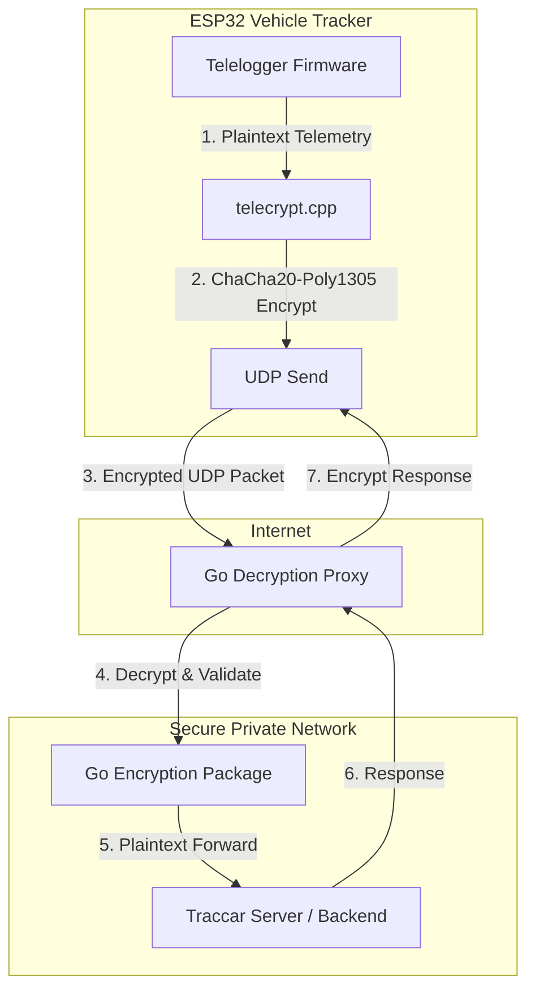

# Developer & Agent Onboarding Guide (AGENT.md)

Welcome to the **freematics-traccar-encrypted** repository! This document serves as a comprehensive technical guide for developers and AI agents working on this codebase. It explains the system architecture, component structures, data flow, cryptographic details, and how to configure, build, and test the project.

---

## 1. Project Overview

This repository provides a transparent, end-to-end encrypted proxy system for the **Traccar Freematics protocol** (UDP). It secures communication between an ESP32-based vehicle tracker (running modified firmware) and a backend Traccar tracking server.

By default, the Freematics UDP protocol transmits vehicle diagnostics, location, and telemetry in plaintext. This project injects **ChaCha20-Poly1305 AEAD** (Authenticated Encryption with Associated Data) directly into the UDP packet lifecycle, guaranteeing:
*   **Confidentiality:** Eavesdroppers cannot read GPS coordinates or vehicle metrics.
*   **Integrity & Authenticity:** Malicious actors cannot spoof telemetry data or replay modified packets.



---

## 2. System Architecture & Components

The codebase is divided into two primary subdirectories:

### A. ESP32 Firmware (`/esp32`)
A customized firmware project built using **PlatformIO** / **VS Code** targeting the ESP32 microcontroller inside the Freematics vehicle tracker.
*   **`libraries/`**: Dependency libraries, including `Crypto` (which contains the ChaCha20-Poly1305 implementation).
*   **`telelogger/`**: The core application logic.
    *   `config.h`: Central firmware configuration. Contains `CHACHA20_KEY` (a 64-character hex-encoded string representing a 256-bit key).
    *   `telecrypt.h` / `telecrypt.cpp`: Implements the C++ cryptographic wrappers.
        *   `encrypt_string()`: Encrypts telemetry payloads using ESP32's hardware random number generator (`esp_fill_random`) to generate nonces.
        *   `decrypt_string()`: Decrypts server responses and performs safe constant-time tag verification using `secure_compare`.
    *   `teleclient.cpp`: Handles network communication. It intercepts outbound buffers before transmission to encrypt them, and decrypts inbound packets immediately upon reception.

### B. Go Proxy Server (`/server`)
A lightweight, high-performance Go service that sits in front of one or more backend servers (e.g., Traccar).
*   **`src/server.go`**: The entrypoint. Handles configuration loading, command-line flags (`--config`), and spawns concurrent UDP listeners for each configured port.
*   **`src/encryption/`**:
    *   `encrypt.go`: Generates a cryptographically secure random 12-byte nonce using Go's `crypto/rand` and encrypts payload responses.
    *   `decrypt.go`: Splits the incoming UDP payload and decrypts it using standard `golang.org/x/crypto/chacha20poly1305`.
*   **`src/logging/`**: Sets up custom logging with structured formats via `sirupsen/logrus`.
*   **Configuration (`config.sample.yml`)**:
    *   Configures listening ports and maps them to plaintext backend destinations (address and port).
    *   Provides the shared `chacha_key`.

---

## 3. Cryptographic Packet Format

The custom packet layout is uniform for both client-to-server and server-to-client UDP traffic:

```
+-------------------+---------------------------------+-------------------------+
| Nonce / IV        | Ciphertext                      | Auth Tag                |
| (12 Bytes)        | (Variable Length)               | (16 Bytes)              |
+-------------------+---------------------------------+-------------------------+
```

### Encryption Steps:
1.  **Nonce Generation:** A fresh 12-byte random nonce is generated for every packet (`esp_fill_random` on ESP32; `crypto/rand` in Go).
2.  **AEAD Encryption:** The payload is encrypted with the 256-bit key using **ChaCha20-Poly1305**.
3.  **Assembly:** The packet is sent as `Nonce (12 Bytes) || Ciphertext (N Bytes) || Authentication Tag (16 Bytes)`.

### Decryption Steps:
1.  **Size Validation:** Verify that the incoming packet is at least $12 + 16 = 28$ bytes long. If it is shorter, or if decryption fails, the Go proxy falls back to forwarding the raw packet (providing graceful support for unencrypted fallback or legacy telemetry if allowed by security rules).
2.  **Parsing:** The first 12 bytes are extracted as the `Nonce`, and the last 16 bytes are extracted as the `Auth Tag`.
3.  **Authentication & Decryption:** The AEAD system authenticates the message using the tag and decrypts the ciphertext.

---

## 4. Key Developer Workflows

### Configuring and Flashing the Client (ESP32)
1.  Run `server/generate-key.sh` to generate a secure random 256-bit key in hex format.
2.  Open the `/esp32/telelogger` folder in VS Code with the PlatformIO extension.
3.  Modify `/esp32/telelogger/config.h` to define your keys and credentials:
    ```cpp
    #define CHACHA20_KEY "YOUR_64_CHAR_HEX_KEY"
    ```
4.  Compile and upload the firmware to your ESP32 tracker via PlatformIO.

### Configuring and Running the Go Server
1.  Navigate to the `/server` directory.
2.  Create your configuration file:
    ```bash
    cp config.sample.yml config.yml
    ```
3.  Configure `config.yml`:
    ```yaml
    chacha_key: "YOUR_64_CHAR_HEX_KEY"
    destinations:
      "5170":  # Port listening on public interface
        address: "127.0.0.1"
        port: 5055  # Port of the backend Traccar server
    ```
4.  Build the binary:
    ```bash
    ./build.sh
    ```
5.  Start the proxy server:
    ```bash
    ./freematics-encrypt --config config.yml
    ```

---

## 5. Development Guidelines & Gotchas

*   **UDP State Management:** UDP is connectionless. When forwarding decrypted payloads to the backend, the Go server uses ephemeral ports (`net.ListenUDP("udp", ":0")`) to receive backend responses and route them back to the correct client IP/Port. Keep an eye on socket/file descriptor limits in highly active production environments.
*   **Constant-Time Verification:** On the ESP32 side, standard tag verification libraries can be unstable or susceptible to timing attacks. The firmware uses `secure_compare` to verify computed authentication tags in constant time to prevent side-channel attacks.
*   **Standard Internet MTU:** Packets are capped at **1500 bytes** (the standard internet MTU) on both client and server buffers to avoid fragmentation issues in UDP. Ensure telemetry payloads do not exceed this limit when encrypted.
*   **Dependencies:**
    *   The Go side relies on `golang.org/x/crypto/chacha20poly1305` and `gopkg.in/yaml.v2`. Keep these dependencies up-to-date with security patches.
