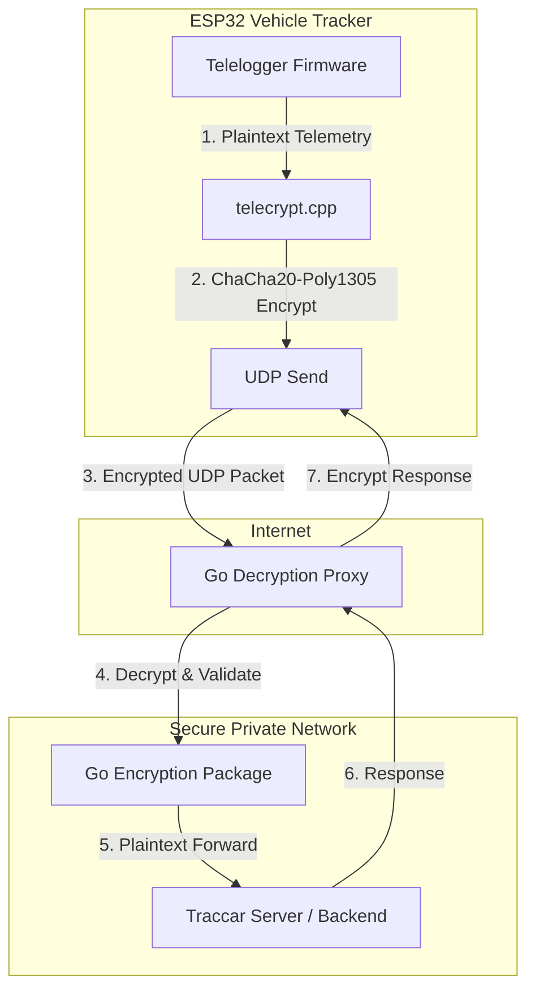

# freematics-traccar-encrypted

[](https://github.com/Harvester57/freematics-traccar-encrypted/actions/workflows/docker-build.yml)
[](https://github.com/Harvester57/freematics-traccar-encrypted/actions/workflows/go-build.yml)

_A transparent, high-performance proxy and custom ESP32 firmware to secure the Traccar Freematics protocol with end-to-end **ChaCha20-Poly1305 AEAD** encryption._

By default, the Freematics UDP telemetry protocol transmits sensitive vehicle diagnostics, speed, and real-time location metrics in plaintext. This project provides a transparent end-to-end encryption pipeline between the vehicle's tracker and your backend [Traccar Server](https://www.traccar.org).

---

## Key Fork Improvements & Features

This fork introduces production-ready features, deployment simplifications, security hardening, and extended capabilities:

*   **Out-of-the-Box Docker Support**: Spin up the decryption server in seconds using the customized [Dockerfile](server/Dockerfile) and [docker-compose.yml](server/docker-compose.yml).
*   **Zero-Config Environment Injection**: The server docker container dynamically generates and overrides configurations at runtime via environment variables (`CHACHA_KEY`, `LISTEN_PORT`, `DEST_ADDRESS`, `DEST_PORT`).
*   **Streamlined Firmware Settings**: Pre-configured, developer-friendly options compiled within config.h for simple toggle configuration (`SERVER_ENCRYPTION_ENABLE`, `CHACHA20_KEY`, `ENABLE_BEEPING`).
*   **Expanded Diagnostics & Fuel Tracking**: Integrated native polling for extra OBD parameters like fuel level (`PID_FUEL_LEVEL`) out of the box.
*   **Structured Logrus Logging**: Upgraded to production-grade structured logging using [sirupsen/logrus](https://github.com/sirupsen/logrus) with clear, trace-friendly request tracking.
*   **Hardened Decryption Security**: Resolves critical memory safety issues (such as buffer overflow mitigations during packet decryption), enforces constant-time validation using `secure_compare`, and aligns with Opus 4.6 security recommendations.
*   **Compile-Time Security Hardening**: Configures the PlatformIO toolchain with security flags (`-fstack-protector-strong`, `-fstack-clash-protection`, and format-string checks) to harden the compiled firmware against stack-based exploits.
*   **ESP32 Power & WiFi Stability**: Mitigates hardware reboots under load by disabling the brownout detector and optimizing WiFi transmitter output power during network activity.
*   **Proactive Threat Modeling**: Documented comprehensive threat models for the [Go server](server/THREAT_MODEL.md), [telelogger firmware](esp32/telelogger/THREAT_MODEL.md), [cryptographic library](esp32/libraries/crypto/THREAT_MODEL.md), and [TinyGPS](esp32/libraries/TinyGPS/THREAT_MODEL.md) components to map attack surfaces and security controls.
*   **Automated CI/CD**: Automated workflows via GitHub Actions for multi-platform Go binary compiling and secure Docker image builds.

---

## System Architecture & Data Flow

Client telemetry is transparently encrypted at the hardware level on the ESP32 and transmitted via UDP. The lightweight Go proxy intercepts the packet, validates authenticity, decrypts it, and forwards it to your Traccar server.



### Cryptographic Packet Format

Every client-to-server and server-to-client UDP packet uses the following authenticated layout:

```
+-------------------+---------------------------------+-------------------------+
| Nonce / IV        | Ciphertext                      | Auth Tag                |
| (12 Bytes)        | (Variable Length)               | (16 Bytes)              |
+-------------------+---------------------------------+-------------------------+
```
> [!NOTE]
> Standard MTU is capped at 1500 bytes to prevent fragmentation issues over UDP. Packets that fail size verification (< 28 bytes) or fail signature checks are dropped to prevent unauthenticated data injection.

---

## 1. Generate Your Key

You need a shared 256-bit encryption key (represented as 64 hex characters) for both the firmware and the server proxy. 

To generate a secure key, you can use any of the following methods:

### Bash / Linux / macOS
Use the included helper script:
```bash
# From the server directory
./generate-key.sh
```
Or use `openssl` directly:
```bash
openssl rand -hex 32
```

### PowerShell (Windows)
Run the following command in your PowerShell terminal:
```powershell
$bytes = New-Object byte[] 32; [System.Security.Cryptography.RandomNumberGenerator]::Create().GetBytes($bytes); [BitConverter]::ToString($bytes).Replace("-", "").ToLower()
```

*Save the generated 64-character hex key.*

---

## 2. Client Setup (ESP32 Firmware)

1. Open the [esp32/telelogger](esp32/telelogger) directory in **Visual Studio Code** with the **PlatformIO** extension installed.
2. Open the [config.h](esp32/telelogger/config.h) file.
3. Locate the custom options block (around line 95) and input your configuration:
   ```cpp
   // Custom options from this fork
   #define SERVER_ENCRYPTION_ENABLE 1
   #define CHACHA20_KEY "YOUR_64_CHAR_HEX_KEY" // <--- Paste your generated hex key here
   #define ENABLE_BEEPING 0
   // End custom options
   ```
4. Adjust your networking settings (WiFi or Cellular APN credentials) and set `SERVER_HOST` to your proxy server's domain/IP.
5. Connect your **Freematics ONE+** tracking device and upload the firmware.

---

## 3. Server Proxy Setup (Go Proxy)

Deploy the Go decryption proxy using any of the following three methods.

### Method A: Docker Container (Recommended)

Run the pre-built Docker image directly. All configuration is injected via environment variables. The entrypoint automatically generates the configuration dynamically:

```bash
docker run -d \
  --name freematics-encrypt \
  --restart unless-stopped \
  -p 5170:5170/udp \
  -e CHACHA_KEY="YOUR_64_CHAR_HEX_KEY" \
  -e LISTEN_PORT=5170 \
  -e DEST_ADDRESS="127.0.0.1" \
  -e DEST_PORT=5055 \
  ghcr.io/harvester57/freematics-traccar-encrypted:master
```

### Method B: Docker Compose

Using Docker Compose is perfect for combining the proxy with other services (like Traccar or databases).

1. Copy the example compose template in your deployment directory:
   ```yaml
   version: '3.8'

   services:
     freematics-encrypt:
       image: ghcr.io/harvester57/freematics-traccar-encrypted:master
       container_name: freematics-encrypt-server
       restart: unless-stopped
       ports:
         - "5170:5170/udp"
       environment:
         - CHACHA20_KEY=YOUR_64_CHAR_HEX_KEY
         - LISTEN_PORT=5170
         - DEST_ADDRESS=192.168.1.200 # IP of your Traccar Server
         - DEST_PORT=5171            # Port Traccar listens on (e.g. 5170/5171)
       security_opt:
         - no-new-privileges:true
   ```
2. Run the service in detached mode:
   ```bash
   docker compose up -d
   ```

> [!TIP]
> If you prefer deploying using a configuration file instead of environment variables, you can mount your custom `config.yml` directly into the container:
> `volumes:`
> `  - ./config.yml:/app/config.yml:ro`

### Method C: Standalone Native Installation

If you prefer deploying a native binary as a service (e.g. via `systemd` on Ubuntu):

1. Navigate to the `server` directory and build the Go binary:
   ```bash
   cd server
   ./build.sh
   ```
2. Create and edit your configuration file:
   ```bash
   cp config.sample.yml config.yml
   ```
3. Open `config.yml` and paste your key and forward destination mappings:
   ```yaml
   chacha_key: "YOUR_64_CHAR_HEX_KEY"
   destinations:
     5170:
       address: 127.0.0.1  # Target Traccar IP
       port: 5171          # Target Traccar Port
   ```
4. Start the server manually:
   ```bash
   ./freematics-encrypt --config config.yml
   ```

> [!NOTE]
> A sample systemd service file is provided in [freematics-encrypt.service](server/freematics-encrypt.service) to help you run the proxy as a persistent background service on Linux hosts.

---

## Configuration Injection Priority (Docker)

When deploying in Docker, the proxy's [entrypoint.sh](server/entrypoint.sh) script handles configuration options gracefully in this order:

1. **Volume Mount Check**: If a custom config file is found at `/app/config.yml` (mounted volume), it uses it as the base.
2. **Environment Variable Injection**: If environment variables are set, they override the values in the config dynamically before starting:
   * `CHACHA_KEY` or `CHACHA20_KEY`: Paste your 64-char encryption key.
   * `LISTEN_PORT`: Port the proxy listens on (defaults to `5170`).
   * `DEST_ADDRESS`: Backend destination address (defaults to `192.168.1.200`).
   * `DEST_PORT`: Backend destination port (defaults to `5171`).

---

## Security Findings Fixed

This repository has undergone extensive security reviews and static analysis audits. Below is a summary of the security vulnerabilities and weaknesses identified and mitigated in the codebase:

### 1. Go Decryption Proxy (server/)

*   **Sensitive Data Exposure in Logs (High)**
    *   *Issue:* Decrypted client telemetry payload containing real-time GPS coordinates, vehicle speeds, and OBD diagnostics was logged at `INFO` level.
    *   *Fix:* Moved plaintext payload logging to `DEBUG` level in [server.go](file:///c:/Users/Florian/OneDrive/Documents/Dev/freematics-traccar-encrypted/server/src/server.go), ensuring production logs only contain safe transmission metadata.
*   **Command Injection in Environment Override (High)**
    *   *Issue:* Environment variables like `CHACHA_KEY` were interpolated directly into `sed` replacement patterns without sanitization.
    *   *Fix:* Added `sanitize_sed` function in [entrypoint.sh](file:///c:/Users/Florian/OneDrive/Documents/Dev/freematics-traccar-encrypted/server/entrypoint.sh) to escape delimiter and metacharacters before processing.
*   **File Descriptor & Ephemeral Port Leak (High)**
    *   *Issue:* A redundant UDP socket listener was created for each incoming packet and never used, risking resource exhaustion.
    *   *Fix:* Removed the unused `net.ListenUDP` socket creation in [server.go](file:///c:/Users/Florian/OneDrive/Documents/Dev/freematics-traccar-encrypted/server/src/server.go).
*   **Flooding/Sensitive Data Exposure in Failure Logs (Medium)**
    *   *Issue:* Full hex dumps of failed-decryption payloads were logged on decryption failure, risking log flooding attacks and exposure.
    *   *Fix:* Truncated raw failure logs in [server.go](file:///c:/Users/Florian/OneDrive/Documents/Dev/freematics-traccar-encrypted/server/src/server.go) to a maximum of 32 characters.

### 2. Telelogger Firmware (esp32/telelogger/)

*   **Decryption Stack Buffer Overflow (High)**
    *   *Issue:* `decrypt_string` lacked an output buffer size parameter, writing decrypted payloads unchecked into a stack buffer.
    *   *Fix:* Refactored `decrypt_string` in [telecrypt.cpp](file:///c:/Users/Florian/OneDrive/Documents/Dev/freematics-traccar-encrypted/esp32/telelogger/telecrypt.cpp) and [teleclient.cpp](file:///c:/Users/Florian/OneDrive/Documents/Dev/freematics-traccar-encrypted/esp32/telelogger/teleclient.cpp) to enforce output bounds via a new `max_output_length` parameter.
*   **Encryption Stack Buffer Overflow (High)**
    *   *Issue:* Hardcoded ciphertext buffer bounds checks could overflow if input data sizes were modified.
    *   *Fix:* Patched `encrypt_string` in [telecrypt.cpp](file:///c:/Users/Florian/OneDrive/Documents/Dev/freematics-traccar-encrypted/esp32/telelogger/telecrypt.cpp) to explicitly validate that output bounds are not exceeded before writing ciphertext.
*   **Robust Memory Allocations (Medium)**
    *   *Issue:* Unchecked `malloc` allocations in buffer manager could lead to null pointer dereferences if memory was exhausted.
    *   *Fix:* Added validation in [teleclient.cpp](file:///c:/Users/Florian/OneDrive/Documents/Dev/freematics-traccar-encrypted/esp32/telelogger/teleclient.cpp) to verify `CBuffer` initialization and clean up allocations on failure.

### 3. FreematicsPlus Library (esp32/libraries/FreematicsPlus/)

*   **Modem AT Command Buffer Overflows (High/Medium)**
    *   *Issue:* APN, host, and URL configurations were formatted into a heap buffer via unbounded `sprintf` calls.
    *   *Fix:* Replaced hazardous formatting calls with `snprintf` using `RECV_BUF_SIZE` boundaries in [FreematicsNetwork.cpp](file:///c:/Users/Florian/OneDrive/Documents/Dev/freematics-traccar-encrypted/esp32/libraries/FreematicsPlus/FreematicsNetwork.cpp).
*   **Modem HTTP/UDP Receive Bounds Violations (High/Medium)**
    *   *Issue:* Null terminators were written at modem-controlled offsets without validating bounds.
    *   *Fix:* Implemented range-checking constraints in [FreematicsNetwork.cpp](file:///c:/Users/Florian/OneDrive/Documents/Dev/freematics-traccar-encrypted/esp32/libraries/FreematicsPlus/FreematicsNetwork.cpp) to restrict writes to valid buffer offsets.
*   **BLE SPP Unbounded Heap Allocation (Medium)**
    *   *Issue:* Client GATT writes dynamically allocated memory via `malloc` without upper size bounds.
    *   *Fix:* Enforced a maximum command length (`SPP_CMD_MAX_LEN`) validation check in [ble_spp_server.c](file:///c:/Users/Florian/OneDrive/Documents/Dev/freematics-traccar-encrypted/esp32/libraries/FreematicsPlus/utility/ble_spp_server.c) and freed overwritten command queues to prevent leaks.

### 4. TinyGPS Library (esp32/libraries/TinyGPS/)

*   **Invalid Checksum Hex Parsing Bypass (Medium)**
    *   *Issue:* Non-hexadecimal characters were parsed as zero instead of failing, leading to potential checksum bypasses.
    *   *Fix:* Refactored `hex2uint8` in [TinyGPS.cpp](file:///c:/Users/Florian/OneDrive/Documents/Dev/freematics-traccar-encrypted/esp32/libraries/TinyGPS/TinyGPS.cpp) to track parsing validity and fail checksum matches on invalid characters.
*   **NMEA Term Index Wrapping Aliasing (Medium)**
    *   *Issue:* Terms index masking allowed wraps when terms exceeded 32, causing aliasing with earlier fields.
    *   *Fix:* Guarded term dispatches in [TinyGPS.cpp](file:///c:/Users/Florian/OneDrive/Documents/Dev/freematics-traccar-encrypted/esp32/libraries/TinyGPS/TinyGPS.cpp) to discard terms past 31.
*   **Long-String Integer Overflow (Medium)**
    *   *Issue:* Long digits string conversion could result in signed integer overflows.
    *   *Fix:* Limited digit processing to 9 digits in [TinyGPS.cpp](file:///c:/Users/Florian/OneDrive/Documents/Dev/freematics-traccar-encrypted/esp32/libraries/TinyGPS/TinyGPS.cpp).
*   **Cardinal Directions Out-of-Bounds Read (Medium)**
    *   *Issue:* Negative direction indices from negative modulo calculations caused out-of-bounds array reads.
    *   *Fix:* Normalized direction modulo ranges to [0, 15] in [TinyGPS.cpp](file:///c:/Users/Florian/OneDrive/Documents/Dev/freematics-traccar-encrypted/esp32/libraries/TinyGPS/TinyGPS.cpp).

---

## Credits & License

*   Original Project: [freematics-traccar-encrypted](https://github.com/soshial/freematics-traccar-encrypted)
*   Inspired by [soshial's writeup on the Freematics OBD tracker security findings](https://gist.github.com/soshial/d07919e0fac67f5501a38fe3c39be416).
*   Firmware based on the original [Freematics Arduino library](https://github.com/stanleyhuangyc/Freematics).
*   Licensed under the [MIT License](LICENSE).